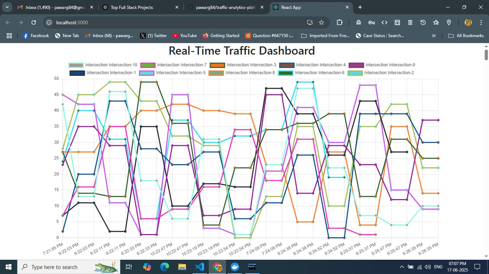
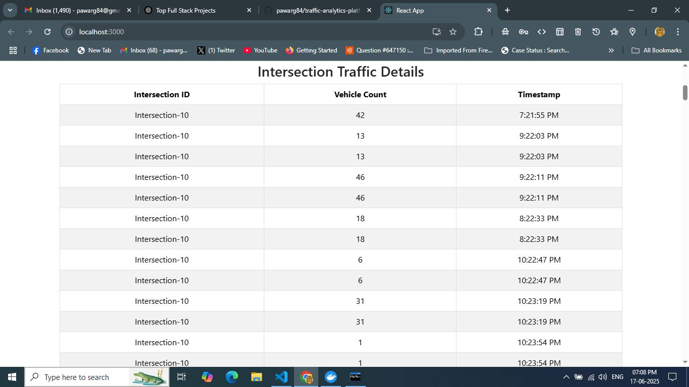

# 🚦 Traffic Analytics Platform

A full-stack real-time traffic monitoring and analytics platform built using **Spring Boot**, **Apache Kafka**, **MySQL**, and **React**. It visualizes live traffic data using interactive charts and tables.

> 🔗 **Live Demo:** [https://your-deployed-app.vercel.app](https://your-deployed-app.vercel.app)

---

## 🧰 Tech Stack

| Layer       | Technology                              |
|------------|------------------------------------------|
| Frontend   | React, Chart.js, Bootstrap               |
| Backend    | Spring Boot, Apache Kafka                |
| Database   | MySQL                                    |
| Streaming  | Server-Sent Events (SSE)                 |
| Deployment | Vercel (Frontend), Render/Heroku (Backend) |

---

## 🚀 Features

- 📡 Real-time traffic data generation using Kafka Producer
- 🎯 Consumer service to stream and persist data to MySQL
- 📊 React dashboard with dynamic charts and tables
- 🔁 SSE (Server-Sent Events) for live updates
- 🔐 CORS-configured secure communication between backend and frontend

---

## 📁 Project Structure

```
traffic-analytics/
├── TrafficDashboard-Backend/     # Spring Boot + Kafka + MySQL
└── TrafficDashboard-Frontend/    # React + Chart.js + Bootstrap
```

---

## 🛠️ Backend Setup (Spring Boot)

### 1. Prerequisites

- Java 17+
- Apache Kafka + Zookeeper running locally
- MySQL Database named `tdb`

### 2. Configure `application.properties`

```properties
spring.datasource.url=jdbc:mysql://localhost:3306/tdb
spring.datasource.username=root
spring.datasource.password=yourpassword

spring.kafka.producer.bootstrap-servers=localhost:9092
```

### 3. Run the Backend

```bash
cd TrafficDashboard-Backend
./mvnw spring-boot:run
```

> The Kafka producer will simulate traffic every 2 seconds and stream via `/traffic-stream`.

---

## 💻 Frontend Setup (React)

### 1. Install dependencies

```bash
cd TrafficDashboard-Frontend
npm install
```

### 2. Run the React App

```bash
npm start
```

> The app will connect to `http://localhost:8080/traffic-stream` and render live traffic data.

---

## ☁️ Deployment

### 🔹 Frontend (Vercel or Netlify)

```bash
npm run build
# Then deploy the `build/` folder to Vercel or Netlify
```

### 🔹 Backend (Render, Railway, or Heroku)

- Create a new Spring Boot app
- Connect to managed MySQL (or configure `DATABASE_URL`)
- Set `KAFKA_BOOTSTRAP_SERVERS` or equivalent if Kafka is hosted elsewhere

---
## 📦 Useful Scripts

### Frontend
- `npm start` – Start the React development server
- `npm run build` – Create production build

### Backend
- `./mvnw spring-boot:run` – Start backend server (Linux/Mac)
- `mvnw.cmd spring-boot:run` – For Windows
---

## 🧪 Sample Traffic Data (MySQL)

```sql
SELECT * FROM trafficdata;
+----+-----------------+---------------+---------------+
| id | location        | timestamp     | vehicle_count |
+----+-----------------+---------------+---------------+
|  1 | Intersection-3  | 1750160198000 |            12 |
|  2 | Intersection-5  | 1750169502840 |            39 |
...
```

---

## 📸 Screenshots

| Realtime Chart                    | Traffic Table                     |
| --------------------------------- | --------------------------------- |
|  |  |

---

## 🙋‍♂️ Author

Made with ❤️ by [Ganesh Pawar](https://github.com/pawarg84)

---

## 📌 License

This project is licensed under the [MIT License](LICENSE)

